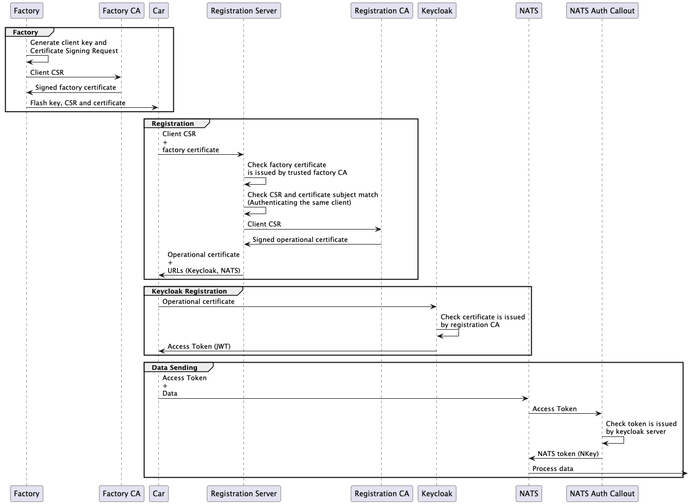

# Registration

1. Each car is issued its own client certificate during manufacturing.
2. Using this certificate, the car authenticates itself with the registration server. The server verifies that the certificate was issued by a trusted factory certificate authority (CA).
3. The car then sends the already in the factory generated Certificate Signing Request (CSR) to the registration server. It authenticates itself using the client certificate from the factory and the server issues a new certificate signed by the registration CA.
4. The signed certificate, along with the necessary URLs for the next steps, is returned to the car.
5. The car uses the provided Keycloak URL to send the new certificate to the Keycloak server. The Keycloak server verifies that the certificate was signed by the registration server.
6. Upon successful verification, the Keycloak server returns a JSON Web Token (JWT), which the car can then use to send data to NATS.

## PKI (Public Key Infrastructure)
This directory is intended to contain all necessary Certificate Authorities generated during the bootstrapping process of the platform after executing the platform's sample-clients.

## Server
This directory contains the registration server. For more information see [its documentation](server/README.md).