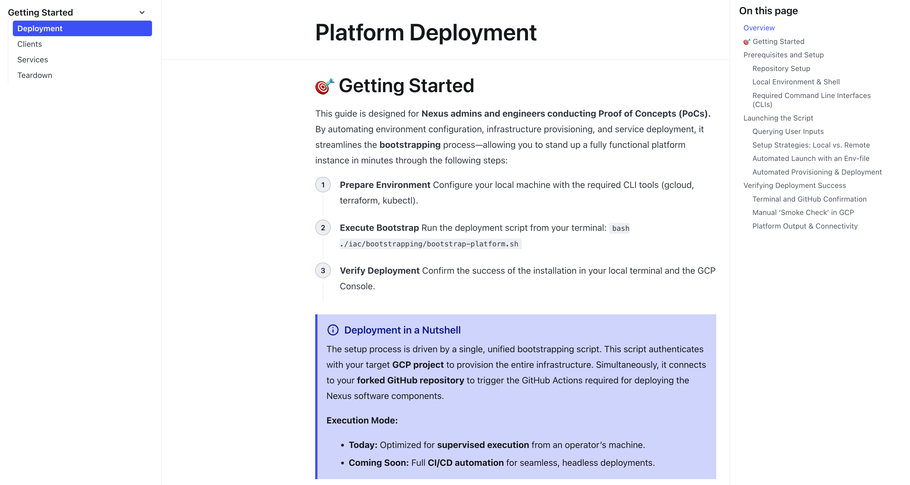
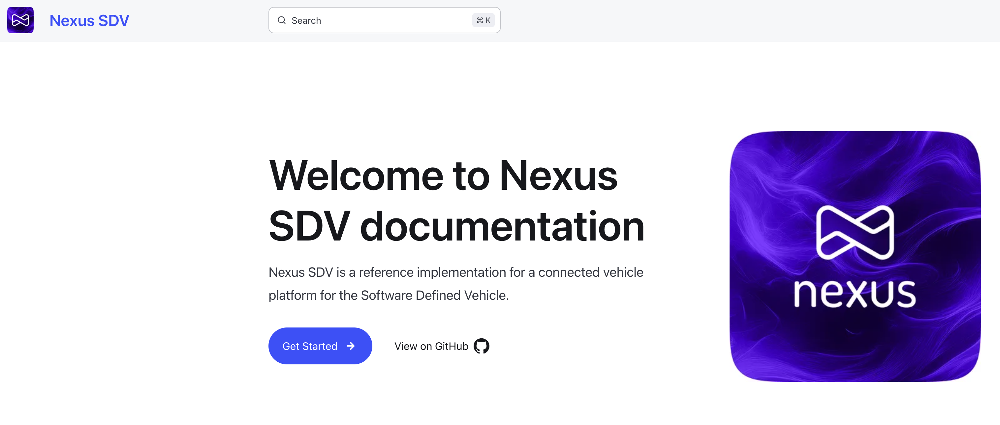

# Nexus SDV: Getting Started Guide

Welcome to the Nexus SDV ecosystem. This guide is designed to take you from a fresh repository to a fully functional connected vehicle cloud backend in just a few logical steps.

## Official Online Documentation (Recommended)

For the best experience, including a global search, streamlined navigation, and correctly rendered callouts, please visit our official documentation portal:

**[docs.nexus-sdv.io](https://docs.nexus-sdv.io)**

---

## Local Repository Documentation

If you prefer to stay within the GitHub environment, you can follow the core technical steps right here. This path is ideal for a quick reference during development.

### The Path to Your Own Platform

Follow these four steps to deploy, connect, and extend your Nexus instance:

* **[1. Deployment](deployment.mdx)** Provision your own Nexus instance on **Google Cloud** using Terraform and our interactive bootstrap script.
  
* **[2. Connected Clients](clients.mdx)** Establish a secure **mTLS connection** and start communicating with the backend using our client examples.

* **[3. Custom Services](services.md)** Leverage Nexus as a foundation for differentiated automotive services based on our template.

* **[4. Resource Teardown](teardown.mdx)** Essential for PoCs: Learn how to efficiently decommission your environment and clean up GCP resources.

---

## Interactive Experience & Visuals

The online portal offers an enhanced user interface designed for architects and developers:

| Home Page | Deployment Guide |
| :--- | :--- |
|  |  |

> **Note on Content Rendering:** > This GitHub-based documentation is the source for our **Astro-based** portal. You may notice specific formatting tags (like `:::tip` or `<Tabs>`). These will appear as plain text here on GitHub but are rendered as professional, color-coded components at [docs.nexus-sdv.io](https://docs.nexus-sdv.io).