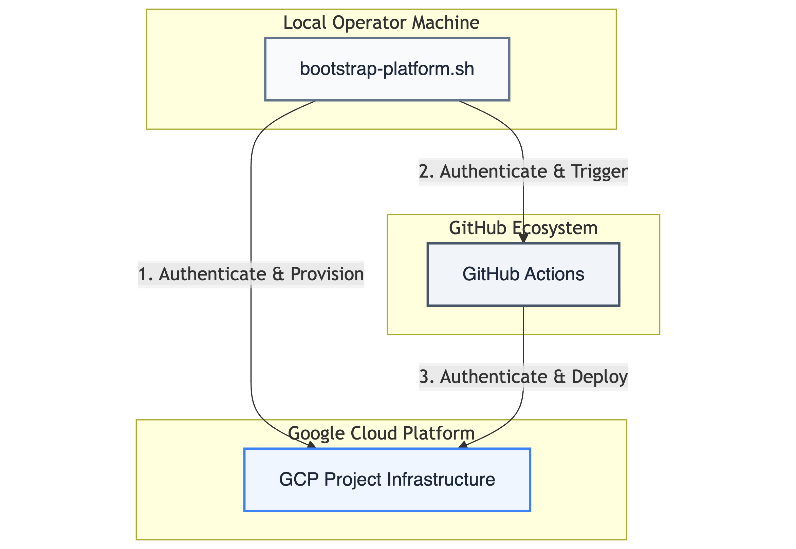
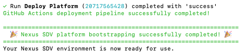
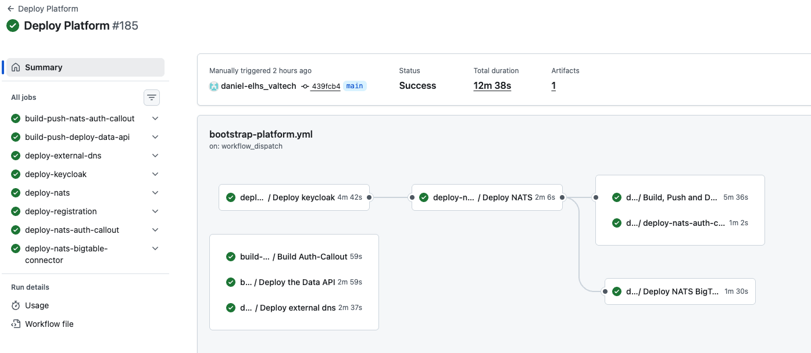

import { Steps } from '@astrojs/starlight/components';
import { Tabs, TabItem } from '@astrojs/starlight/components';

## 🎯 Getting Started

This guide is designed for **Nexus admins and engineers conducting Proof of Concepts (PoCs).** By automating environment configuration, infrastructure provisioning, and service deployment, it streamlines the **bootstrapping** process—allowing you to stand up a fully functional platform instance in minutes through the following steps:

<Steps>

1. **Prepare Environment**
   Configure your local machine with the required CLI tools (gcloud, terraform, kubectl).

2. **Execute Bootstrap**
   Run the deployment script from your terminal:
   ```bash ./iac/bootstrapping/bootstrap-platform.sh```

3. **Verify Deployment** Confirm the success of the installation in your local terminal and the GCP Console.

</Steps>

:::note[Deployment in a Nutshell]
The setup process is driven by a single, unified bootstrapping script. This script authenticates with your target **GCP project** to provision the entire infrastructure. Simultaneously, it connects to your **forked GitHub repository** to trigger the GitHub Actions required for deploying the Nexus software components.

**Execution Mode:**
* **Today:** Optimized for **supervised execution** from an operator's machine.
* **Coming Soon:** Full **CI/CD automation** for seamless, headless deployments.
:::




## Prerequisites and Setup

Before running the bootstrapping script, ensure your repository and local environment are prepared.

### Repository Setup
1. **Fork the Repository:** Fork the [official Nexus SDV repository](https://github.com/GoogleCloudPlatform/nexus-sdv) into your own (private) GitHub account.
2. **Clone Locally:** Clone your fork to the machine from which you will run the deployment.

### Local Environment & Shell
The bootstrapping script is developed and best tested for the **Bash** shell. While other shells might work, we recommend using Bash for the most stable experience.

### Required Command Line Interfaces (CLIs)
The following tools must be installed and available in your `$PATH`:

| Tool | Purpose |
| :--- | :--- |
| [Google Cloud CLI](https://cloud.google.com/sdk/docs/) | Authentication and GCP resource management. |
| [GitHub CLI (`gh`)](https://cli.github.com/) | Managing repository variables and triggering Actions. |
| [Terraform CLI](https://developer.hashicorp.com/terraform/install) | Provisioning the Cloud Infrastructure (IaC). |
| [OpenSSL](https://openssl-library.org/) | Generation of secure tokens and secrets. |
| [Nk](https://docs.nats.io/using-nats/nats-tools/nk) | Creating NKeys for NATS communication authentication. |


## Launching the Script
Execute the `bootstrap-platform.sh` script from the project's root directory to initially set up the platform:
```bash
$ bash iac/bootstrapping/bootstrap-platform.sh
```

The script will check whether all necessary prerequisites have already been installed. If not, the script will output a list with all missing tools to be installed and break.


:::tip[Authentication]
The script will attempt to log you into GCP and GitHub. Keep your browser ready to confirm the login requests to obtain the necessary access tokens.
:::

### Querying User Inputs
After authentication, the script will prompt you for the following configuration data to set up your environment:

1. **Google Cloud Project ID (`GCP_PROJECT_ID`):** The ID of the GCP project where the platform will be deployed.
2. **Google Cloud Region (`GCP_REGION`):** The target region for your infrastructure (e.g., `europe-west3`).
3. **GitHub Repository Notation (`GITHUB_REPO`):** Your forked repository in the format `owner/repo`.
4. **GitHub Environment (`ENV`):** The name of the environment to be created or reused within your GitHub project.
5. **Setup Strategy (`PKI_STRATEGY`):** `local` or `remote`, see below.  

### Setup Strategies: Local vs. Remote
For your first deployment, we recommend starting with the **Local** strategy.

<Tabs>
  <TabItem label="Local Setup (Recommended)">
    The **Local** strategy is the fastest way to get started. It uses **IP addresses** instead of DNS names and relies on self-signed certificates.
    
    * **Pros:** Rapid setup, no DNS or CA configuration required.
    * **Cons:** Limited to IP-based communication; no custom domain support.
  </TabItem>
  <TabItem label="Remote Setup (Advanced)">
    The **Remote** strategy is designed for production-like environments. It leverages **Google Cloud DNS** and the **GCP Certificate Authority Service (CAS)** to establish a managed, scalable Chain of Trust.

    **Prerequisites:**
    * A registered **DNS Domain** and an active **Cloud DNS Zone** within your Google Cloud project.

    **Interactive Setup:**
    The deployment script will guide you through an interactive dialog to capture your configuration. Key parameters include:

    ```bash
    PKI_STRATEGY="remote"
    BASE_DOMAIN="nexus.your-oem-domain.com"
    EXISTING_DNS_ZONE="nexus-your-oem-domain-com"
    ```

    Beyond these, the script will prompt for additional environment-specific details, such as **endpoint hostnames**, **CA and CA-pool identifiers**. All inputs are persisted in your `.bootstrap_env` for future reference.

    > ⚠️ **Critical: Backup your `.bootstrap_env`**
    > The values captured in this file are **essential for a successful teardown**. Without it, the script cannot cleanly decommission managed resources like CA Pools and DNS records. **Always keep a secure backup.**

    **Automated Infrastructure Output:**
    Nexus handles the complexity of production setups automatically. The script:
    * **Provisions Managed CAs:** Creates GCP CA Pools and Sub-CAs based on your inputs.
    * **Writes Metadata:** Automatically exports all generated identifiers back into the `.bootstrap_env`.
    * **DNS Orchestration:** Sets up the necessary A-records and managed zones.

    * **Pros:** Full mTLS with managed CAs, professional DNS endpoints, production-grade security.
  </TabItem>
</Tabs>

---

:::note[GitHub Environment]
The script will create a new environment in GitHub to store deployment attributes. If an environment with the same name already exists, it will be overwritten to prevent errors during the configuration of environment variables. Note that only variables are used, no GitHub secrets.
Please ensure that the environment notation input (`ENV`) consists of a maximum of 15 chars length. If your input is longer than 15 chars, the setup will fail during the initial **terraform apply**.
:::


### Automated Launch with an Env-file

To skip the interactive dialogues and provide the required inputs automatically, you can create a configuration file named `.bootstrap_env`.

**Placement:** Save this file in the `iac/bootstrapping/` directory. The script will automatically detect these variables and bypass the manual prompts.

**Example `.bootstrap_env` for Local Setup:**

```bash
GCP_PROJECT_ID="sdv-sandbox"
GCP_REGION="europe-west3"
GITHUB_REPO="your-user/valtech-sdv-sandbox"
ENV="sandbox"
PKI_STRATEGY="local"
```


### Automated Provisioning & Deployment

Now that the configuration is set, you can relax and monitor the progress in your console. The bootstrapping script will handle the heavy lifting across your GCP project and GitHub repository in a coordinated sequence:

:::tip[Time for a Coffee]
Provisioning the full infrastructure stack can take up to **20 minutes**. The creation of the Cloud SQL database for Keycloak typically accounts for the largest portion of this duration.
:::

#### What is happening in the background?

The deployment follows a three-stage execution flow:

1. **Infrastructure Provisioning (Terraform):** Essential Google Cloud resources are set up using Terraform. This includes the API activation, the Terraform state bucket, and the core infrastructure components.

2. **Configuration & Security Mapping:** In between the main steps, the script creates GitHub environment variables within your specified repository and stores secrets within the **Google Cloud Secret Manager**. This stage is essential for establishing the automatic deployment flow and managing platform keys for **mutual TLS (mTLS)** and CA registration.

3. **Software Deployment (GitHub Actions):** Once the foundation is secure, the platform's base services are deployed via GitHub Actions pipelines. These components are automatically distributed to their target runtimes on **Google Cloud Run** and **Google Kubernetes Engine (GKE)**.

## Verifying Deployment Success

Once the bootstrapping script completes its execution, you should see a confirmation in your terminal accompanied by several green success indicators.

### Terminal and GitHub Confirmation
A successful deployment is characterized by the following outputs:

* **Terminal:** The script will print `Nexus SDV platform bootstrapping successfully completed!` along with celebratory emojis.

* **GitHub Actions:** In your forked repository, the **"Deploy Platform"** workflow should show a green "Success" status. You can verify the individual jobs (e.g., Keycloak deployment, NATS setup) in the GitHub Actions tab.



### Manual 'Smoke Check' in GCP
To ensure all infrastructure components are correctly provisioned, log in to your **Google Cloud Console** and verify the following:

| Service | Expected Resource |
| :--- | :--- |
| **Cloud Storage** | A bucket named `[gcp-project-name]-tfstate` containing the `default.tfstate` file. |
| **Kubernetes Engine** | A GKE cluster named `[env]-gke` with healthy, running pods. This hosts the Nexus base services (Status: Green).|
| **BigTable** | An active BigTable instance named `bigtable-production-storage` ready for data ingestion. |


:::tip[Technical Deep Dive]
For a complete list of all provisioned resources, you can always refer to the Terraform configuration files located in the `iac/terraform` directory of your repository.
:::

### Platform Output & Connectivity
In a **Local Setup**, the platform relies on IP addresses.
* **IP Addresses:** Check the script output for the assigned external IP addresses of your GKE services.
* **Sample Client:** You can find initial connectivity tests in the `sample-client` folder. 

:::note
A detailed guide on how to use the **Sample Client** to interact with your new Nexus SDV instance will be covered in the next section of this documentation.
:::