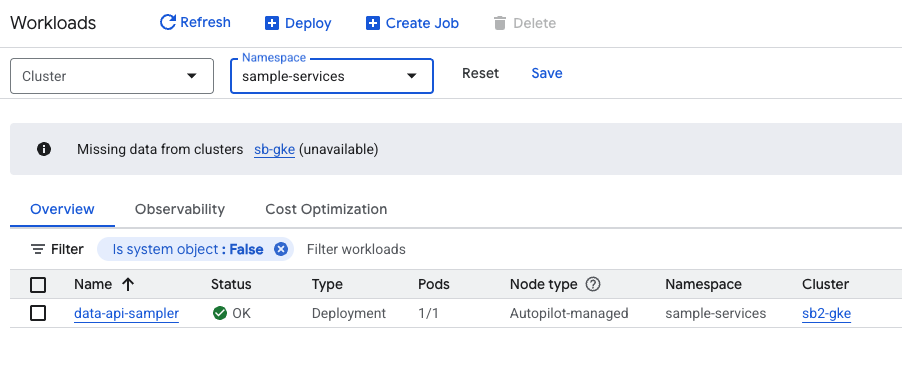

## 🎯 Getting Started

This guide assumes that the Nexus platform has been successfully deployed and that both sample clients have ingested data. We will demonstrate how to retrieve this data using the **Nexus Data API**.

:::note[Leveraging BigTable in Google Cloud]
As covered in the Clients Getting Started guide, data is ingested through the NATS broker into a BigTable instance's table called `telemetry`. While the simplest way to access this data is via native GCP tools like **BigTable Studio, BigQuery, Vertex AI, or Looker**, this guide focuses on an abstracted, generic approach: writing applications that leverage ingested telemetry data via an API layer.
:::


To continue with this guide, follow these steps:

<Steps>

1. **Deploy the Data API Sampler**
   We provide a sample Nexus application that is not part of the base services. You will need to deploy this component manually to your environment.

2. **Request Data via REST**
   Our examples utilize **curl**, though you can use any preferred REST client (e.g., Postman or Insomnia) to interact with the API.

</Steps>

## Deploy the Data API Sampler

Just like the Nexus base components, the Data API Sampler is deployed via GitHub Actions. We have pre-configured the necessary workflow within the repository.

To start the deployment, navigate to the **Actions** tab of your forked Nexus repository. Locate and trigger the following workflow:  
**"Build, Push and Deploy the Data-API Sampler service"** (`build-push-deploy-data-api-sampler.yml`).

:::tip[Remember your GitHub Environment]
When running the workflow, you must specify the **GitHub Environment** you created during the initial bootstrapping. This allows the action to identify your target GCP project. If you are unsure, you can find the correct value in your `iac/bootstrapping/bootstrap_env` file under the variable `ENV`. 
:::

### Check Deployment Success

Once the pipeline has completed, verify that the service was successfully deployed. You can find it in the **Google Cloud Console** under the **GKE Workloads** screen.



The service is deployed within a dedicated namespace called `sample-services`, keeping it isolated from the Nexus SDV `base-services`. 

### Retrieve Service Endpoint
To interact with the Data API Sampler service, you will need its external IP address. Navigate to the **Deployment Details** screen for the `data-api-sampler` within the GKE console. You can find the assigned endpoint in the **Exposing services** section at the bottom of the screen.

## Request Data via REST
Now it is time to test the Data API Sampler. Run the following command and remember to **replace the IP with your specific service endpoint**:
```bash
curl 34.89.251.211:8080/health | jq 
```

The output should look similar to this:
```bash
{
  "groups": [
    "liveness",
    "readiness"
  ],
  "status": "UP"
}
```

You can use these commands to retrieve the data transmitted by the **Go client**:
```bash
curl 34.89.251.211:8080/data/VEHICLE001/datatypes/dynamic:battery.temp | jq 
```

Output:
```bash
{
  "dynamic:battery.temp": [
    "\"25.15\""
  ]
}
```

```bash
curl "34.89.251.211:8080/data/VEHICLE001/datatypes/dynamic:battery.temp?lookback=1d" | jq 
```

Output:
```bash
{
  "dynamic:battery.temp": [
    "\"24.81\"",
    "\"25.24\"",
    "\"25.08\"",
    "\"25.30\"",
    "\"25.16\"",
    "\"25.05\"",
    "\"25.00\"",
    "\"25.29\"",
    "\"25.15\""
  ]
}
```

To retrieve data transmitted by the **Python client**, the request needs to be slightly modified:
```bash
curl "34.89.251.211:8080/data/VEHICLE001/datatypes/static:index?lookback=1d" | jq
```

Output:
```bash
{
  "static:index": [
    "\"0\"",
    "\"1\"",
    "\"2\"",
    "\"3\"",
    "\"4\"",
    "\"5\"",
    "\"6\""
  ]
}
```

```bash
curl "34.89.251.211:8080/data/VEHICLE001/datatypes/static:test_key?lookback=1d" | jq
```

Output:
```bash
{
  "static:test_key": [
    "\"test_value\"",
    "\"test_value\"",
    "\"test_value\"",
    "\"test_value\"",
    "\"test_value\"",
    "\"test_value\"",
    "\"test_value\""
  ]
}
```

## Conclusion

We hope this guide helped you understand how data can be retrieved from BigTable using the Data API Sampler. You can use this service as a template to build your own custom applications on top of Nexus.

We plan to provide more sample services soon, including the ones featured in our **IAA Mobility 2025 showcase**. You can view the corresponding video on our **[Nexus SDV landing page](https://www.valtech.com/industries/mobility/nexus-sdv-platform/)**.
